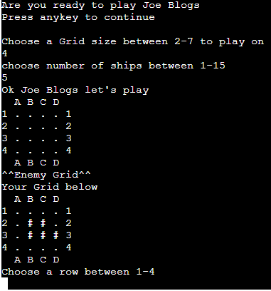

# Battleships Game

Battleships Game is a python terminal game, which runs in Code institute mock terminal Heroku

Users choose a grid square on the computers board to try and find the computers ships before the 
computer finds theirs. The user can see there ships and where the computer has shot on their grid
and can see where they have shot on the computers grid.

## Features 

### Existing Features
- __Data control__

  - Data for each sides board and ships is contained in a class.
    - Grid locations and state are stored in a dictionary in the class.
  - The scores, grid size and number of ships stored in a dictionary. 

- __Grid generation__

  - A square grid is generated for each side to be displayed during the game.
  - Ships are randomly placed on each grid. 
  - Users can not see the computers ships.
  - Grid has letters and numbers along sides to help choose square.
  - Hits, misses and ships are displayed with symbols explained after player enters name.

 - 

- __User input and validation__

  - Users are asked for a grid square by row and column with prompts of possible choices. 
  - If selected row or column is not on the grid they are asked to resubmit that data.
  - If user selects a square they have already guessed they are asked to resubmit data.
  - Incorrect inputs return "' ' is invalid" and asks them to resubmit.

- __Grid size and ship number__ 

  - Allows player to choose number of ships between 1 and 26 as long as it doesn't fill
    the board.
  - Allows player to choose grid size between 2 and 7.

 

- __Score__

  - How many shots there have been and how many ships they hit is told to the user at
    the end of every turn.
  - Users are told how many ships they have left and how many they have left to sink.
  - Users are told if they hit or missed every turn.

 

### Features Left to Implement

- Allow players to place there own ships 
- Ships of different sizes 
- Having the computer make better quesses when ships are bigger than one square
- Could have more than one player for players vs player or 3 player game.

------
## Testing 

__How testing was done__

- Testing in my local terminal and Heroku app.
- Passed code through a PEP8 linter and confirmed there are no problems 
- Given invalid data
    - letters where numbers are expected and the reverse
    - no data entered
    - Blank spaces and random symbols like ! {} []
- Set a debug_mode in the print_grid function to show computer ships when
  Debug_mode is True. Allowing to test hit, miss and win messages and 
  test score tracking.

__Bugs fixed__

- Enteries such as symbols ] , } and empty space were being accepted when not in the accepted 
  range and caused crashes when trying to change to an interger. I fixed this by adding a list 
  of unexcepted characters.
- Grid size can't be bigger than 26 as it runs out of letters. fixed by limiting grid size.
- Grid size can't be bigger that 9 as it miss aligns the row with the column. fixed by limiting
  choice of grid size.
- Input request was to long inside while and if statements, so set to a variable.
- Using user input of letters made for too long code or crashes. fixed by changing letter input
  recieved into a number using ord(x) - 65 .

__Remaining Bugs__

- No bugs remaining

__Validator Test__

- PEP8
  - no errors returned from

------

## Deployment

Battleships Game was deployed using code institues mock terminal for Heroku. 

- The steps to deploy to Heroku are as follows: 
  - Created a new Heroku app.
  - Set build packs to Python and Nodejs in that order.
  - Link Heroku app to the repository.
  - Clicked launch

The live link can be found here - https://awesome-battleships-game.herokuapp.com/

## Credits 

- Code institute for the deployment terminal
